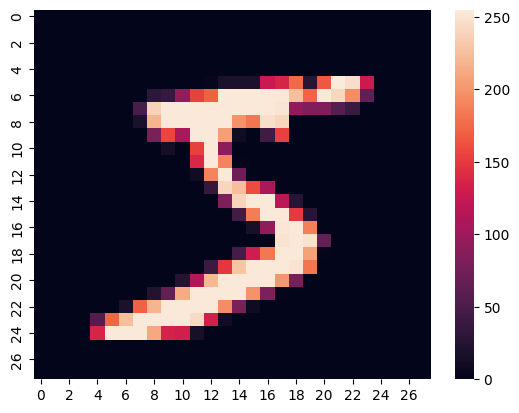
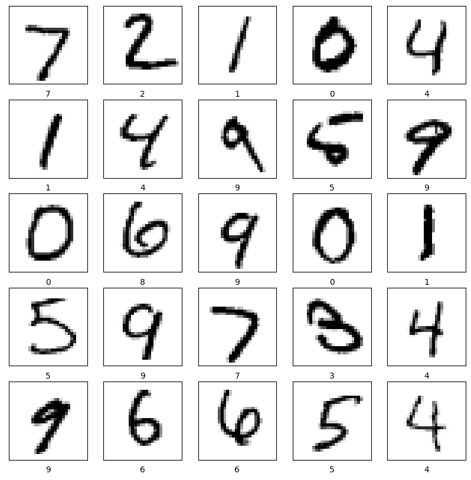

# MNIST Handwriting Recognition with CNN

A computer vision project that classifies handwritten digits (0–9) using a Convolutional Neural Network (CNN) trained on the MNIST dataset. 

## 🧠 Overview

This project demonstrates how to build a neural network using TensorFlow and Keras to:

- Load and visualize the MNIST dataset
- Normalize and preprocess image data
- Construct a CNN using convolutional and pooling layers
- Train the model to classify grayscale images of digits
- Evaluate performance using test accuracy
- Visualize predictions and intermediate data

---

## 📁 Dataset

**Source**: [MNIST Dataset](https://www.kaggle.com/datasets/hojjatk/mnist-dataset)

- **Images**: 28x28 grayscale
- **Classes**: Digits from 0 to 9 (10 total classes)
- **Training set**: 60,000 images
- **Test set**: 10,000 images

---

## 🏗️ CNN Architecture

The CNN model was implemented using Keras Sequential API and contains:

- **Input Layer**: `(28, 28, 1)` grayscale images
- **4 Convolutional Layers**:
  - Filters: 16, 32, 64, 128
  - Kernel Size: 3
  - Batch Normalization
  - ReLU Activation
- **Global Average Pooling Layer**
- **Dense Output Layer**: 10 neurons (one per digit class)

---

## 📊 Model Performance

| Metric     | Value      |
|------------|------------|
| **Loss**   | 0.2012     |
| **Accuracy** | 93.5%     |

The model achieves strong accuracy on the test set, demonstrating its ability to generalize to unseen handwriting.

---

## 📷 Visualizations

### 🔍 Sample Image from Training Set



### 📈 Sample Prediction Output

The image below shows a grid of sample predictions from the test set. Each image is labeled with the model’s predicted digit. Most of the predictions match the correct labels, indicating that the model has learned to accurately recognize handwritten digits.

We can observe that:

- **Most predictions are correct**, even for digits written in a less conventional style.
- The model is particularly confident when the digit is clearly written (e.g., 0, 1, 7).
- **Misclassifications** are rare but tend to happen when digits are ambiguous or poorly written (e.g., a messy 5 might be mistaken for a 6).

These results highlight the model’s strong generalization ability and robustness to handwriting variation.



---

## 🚀 Installation & Running

To get started, make sure you have the required Python packages installed:

### 🧪 Required Libraries

Install the following dependencies using pip:

```bash
pip install tensorflow numpy matplotlib seaborn
```

### ▶️ Run the Training Script

Run the main script to train the CNN model on the MNIST dataset:

```bash
python MNIST_HandwritingRecognition.py
```

This will:

- Load and preprocess the MNIST data
- Build and train the CNN model
- Evaluate accuracy on the test set
- Save model outputs and generate visualizations

---
